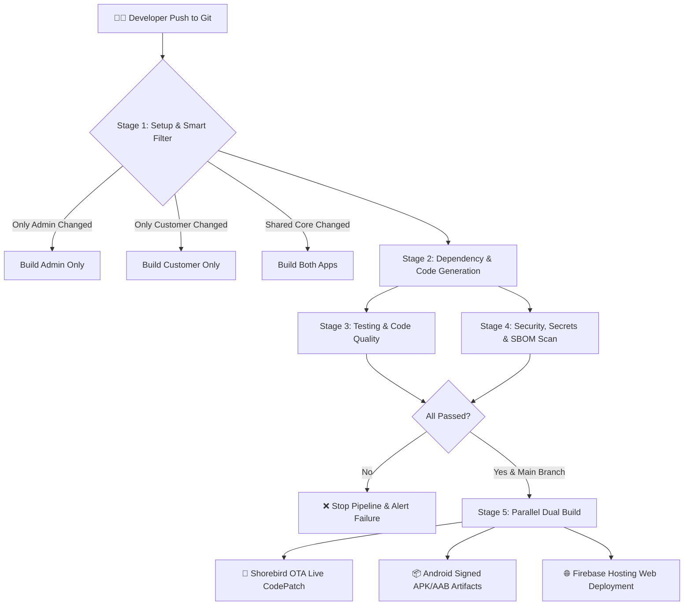

# 🚀 পাইকারী বাজার (Paykari Bazar) — CI/CD Pipeline বিস্তারিত গাইড ও আর্কিটেকচার
## (Continuous Integration & Continuous Deployment Master Guide)

**তারিখ:** সেপ্টেম্বর ২০২৬  
**স্ট্যাটাস:** প্রোডাকশন গ্রেড অটোমেশন (Production-Grade Automated Pipeline)  
**প্ল্যাটফর্ম:** GitHub Actions + Flutter (Android & Web) + Shorebird CodePush + Firebase Cloud  
**রেফারেন্স ফাইল:** [`.github/workflows/auto-build-and-deploy.yml`](file:///f:/paykaribazar/.github/workflows/auto-build-and-deploy.yml)

---

## 📌 ১. পরিচিতি ও উদ্দেশ্য (Overview)

**CI/CD (Continuous Integration & Continuous Deployment)** হলো এমন একটি স্বয়ংক্রিয় পাইপলাইন যা কোড কমিট হওয়া মাত্রই স্বয়ংক্রিয়ভাবে কোড টেস্ট করে, বাগ চেক করে, সিকিউরিটি স্ক্যান করে এবং সরাসরি গুগল ড্রাইভ/প্লে স্টোর বা ক্লাউডে রিলিজ ফাইল পাঠিয়ে দেয়। 

পাইকারী বাজারে এই পাইপলাইনের মাধ্যমে:
1. কোড কমিটের সাথে সাথে **Customer App** এবং **Admin App** আলাদাভাবে ভ্যালিডেট হয়।
2. কোড ভাঙলে বা টেস্ট ফেইল করলে স্বয়ংক্রিয়ভাবে নোটিফিকেশন পাঠায় এবং ডিপ্লয়মেন্ট আটকে দেয়।
3. **Shorebird OTA** ব্যবহার করে প্লে স্টোরের দীর্ঘ রিভিউ ছাড়াই ব্যবহারকারীদের ফোনে সরাসরি নতুন কোড বা বাগ ফিক্স পৌঁছে যায়।

---

## 🔄 ২. সম্পূর্ণ পাইপলাইন আর্কিটেকচার ফ্লোচার্ট (Pipeline Architecture)



---

## 🛠️ ৩. বিস্তারিত পর্যায়ভিত্তিক বিশ্লেষণ (Detailed Stages)

### 📍 পর্যায় ১: প্রস্তুতি ও স্মার্ট পাথ ফিল্টারিং (Setup & Smart Change Detection)
* **রানটাইম:** Ubuntu-latest রানারে Flutter `3.27.0`, Java `17`, এবং Node.js `22` স্বয়ংক্রিয়ভাবে লোড হয়।
* **বিল্ড নম্বর জেনারেশন:** Git হিস্টোরির মোট কমিট সংখ্যা গণনা করে স্বয়ংক্রিয় বিল্ড নম্বর তৈরি হয় (`git rev-list --count HEAD`)।
* **স্মার্ট পাথ ফিল্টার (`dorny/paths-filter`):**
  * `lib/src/features/admin/**` পরিবর্তিত হলে ➔ শুধুমাত্র **Admin App** বিল্ড হবে।
  * `lib/src/features/customer/**` পরিবর্তিত হলে ➔ শুধুমাত্র **Customer App** বিল্ড হবে।
  * `lib/src/core/**` বা `pubspec.yaml` পরিবর্তিত হলে ➔ উভয় অ্যাপ একসাথে বিল্ড হবে।
  * ডকুমেন্টেশন বা টেক্সট ফাইল (`.md`, `.txt`) কমিট হলে অপ্রয়োজনীয় বিল্ড বন্ধ রাখা হয়।

---

### 📍 পর্যায় ২: বিল্ড রানার ও ডার্ট কোড জেনারেটর (Prepare & CodeGen)
* `flutter pub get` করে প্রয়োজনীয় সমস্ত প্যাকেজ নামানো হয়।
* রিয়েল ফায়ারবেস সিক্রেটের অভাবে যেন CI টেস্ট আটকে না যায়, সেজন্য `create_dummy_firebase_options.sh` দিয়ে মক কনফিগারেশন তৈরি করা হয়।
* `dart run build_runner build` কমান্ড চালিয়ে Riverpod, Freezed এবং JSON সিরিয়ালাইজার ফাইল তৈরি করা হয়।
* জেনারেটেড ফাইলগুলো পরবর্তী স্টেজের জন্য ক্যাশ (`actions/cache`) করা হয়।

---

### 📍 পর্যায় ৩: কোড কোয়ালিটি ও টেস্ট সুট (Testing & Code Quality)
* **Dependency Audit:** `flutter pub outdated` ও `dart pub audit` দিয়ে কোনো প্যাকেজে দুর্বলতা আছে কি না যাচাই করা হয়।
* **Flutter Analyze:** কোডে কোনো সিনট্যাক্স এরর, আনইউজড ভেরিয়েবল বা ভুল টাইপ কাস্টিং থাকলে বিল্ড ফেইল করানো হয় (`flutter analyze lib/ test/`)।
* **Dart Code Metrics:** কোডের জটিলতা (Cyclomatic Complexity) পরিমাপ করা হয়।
* **Unit Testing & Coverage:** `flutter test --coverage` কমান্ডের মাধ্যমে সমস্ত ইউনিট টেস্ট সম্পন্ন করে `lcov.info` কভারেজ রিপোর্ট তৈরি হয়।

---

### 📍 পর্যায় ৪: ট্রিপল-লেয়ার সিকিউরিটি অডিট (Security Scan & SBOM)
1. **Trivy Vulnerability Scanner:** ফাইল সিস্টেমে পরিচিত কোনো সিকিউরিটি ত্রুটি (CVEs) আছে কি না স্ক্যান করে GitHub Security ট্যাবে রিপোর্ট আপলোড করে।
2. **TruffleHog (Secret Leak Detection):** কোডবেসের কোনো ফাইলে বা কমিট হিস্টোরিতে ভুল করে কোনো API Key, পাসওয়ার্ড বা প্রাইভেট সিক্রেট পুশ হয়েছে কি না তা ডিটেক্ট করে।
3. **SBOM (Software Bill of Materials):** `syft` টুলের সাহায্যে প্রজেক্টের সমস্ত ওপেন সোর্স ডিপেন্ডেন্সির সিকিউরিটি ও লাইসেন্স বিল (`sbom.spdx.json`) তৈরি করে সংরক্ষণ করা হয়।

---

### 📍 পর্যায় ৫: সমান্তরাল মোবাইল বিল্ড ও লাইভ ডেপ্লয়মেন্ট (Dual Build & OTA)
* **প্যারালাল ম্যাট্রিক্স রান:**
  ```yaml
  strategy:
    matrix:
      app: [customer, admin]
  ```
  একই সময়ে সমান্তরালভাবে কাস্টমার অ্যাপ এবং অ্যাডমিন অ্যাপ দুটি আলাদা থ্রেডে বিল্ড হয়।
* **অ্যান্ড্রয়েড সাইনিং:** GitHub Secrets থেকে `KEYSTORE_BASE64` ডিকোড করে `upload-keystore.jks` তৈরি করে সিকিউর সাইন করা হয়।
* **Shorebird CodePush (ওটিএ প্যাচিং):**
  * প্রথমে `shorebird patch android` চালানোর চেষ্টা করে—যদি শুধু ডার্ট/বিজনেস লজিক পরিবর্তন হয়, তবে অ্যাপ স্টোর ছাড়াই গ্রাহকদের ফোনে মুহূর্তের মধ্যে প্যাচ আপডেট পৌঁছে যায়।
  * যদি নেটিভ লাইব্রেরি বা কোডে বড় পরিবর্তন আসে, তবে `shorebird release android` দিয়ে মূল রিলিজ প্যাকেজ তৈরি হয়।
  * Shorebird ফেইল করলে সেফটি ফলব্যাক হিসেবে স্ট্যান্ডার্ড `flutter build apk` চালানো হয়।
* **আর্টফ্যাক্টস সংরক্ষণ:** বিল্ড শেষে `app-customer-release.apk` এবং `app-admin-release.apk` গিটহাব অ্যাকশনসে ডাউনলোড করার জন্য জমা রাখা হয়।

---

## 🔐 ৪. প্রয়োজনীয় গিটহাব সিক্রেটস (GitHub Secrets Configuration)

পাইপলাইনটি সচল রাখতে গিটহাব রিপোজিটরির **Settings ➔ Secrets and variables ➔ Actions**-এ নিচের সিক্রেটগুলো কনফিগার করা থাকে:

| সিক্রেট নাম | বিবরণ |
|---|---|
| `KEYSTORE_BASE64` | অ্যান্ড্রয়েড রিলিজ সাইনিং `.jks` ফাইলের Base64 এনকোডেড স্ট্রিং |
| `ANDROID_KEYSTORE_PASSWORD` | কী-স্টোরের মূল পাসওয়ার্ড |
| `ANDROID_KEY_PASSWORD` | কী-এর পাসওয়ার্ড |
| `ANDROID_KEY_ALIAS` | সাইনিং এলিয়াস নাম (যেমন: `upload`) |
| `SHOREBIRD_AUTH_TOKEN` | Shorebird ক্লাউড প্যাচিং সার্ভিসের অথেনটিকেশন টোকেন |
| `FIREBASE_TOKEN` | ফায়ারবেস ক্লাউড ডিপ্লয়মেন্ট টোকেন |

---

## ⚡ ৫. ডেভেলপারদের জন্য লোকাল স্ক্রিপ্টস (Local Convenience)

যদি গিটহাবে পুশ না করে নিজের কম্পিউটারে একই ধরণের বিল্ড বা টেস্ট চালাতে চান, তবে প্রজেক্টের `scripts/` ফোল্ডারে প্রস্তুত থাকা স্ক্রিপ্টগুলো ব্যবহার করতে পারেন:

* **টেস্ট চালাতে:**
  ```powershell
  .\scripts\test.bat
  ```
* **কাস্টমার বা অ্যাডমিন APK বিল্ড করতে:**
  ```powershell
  .\scripts\build.bat customer
  .\scripts\build.bat admin
  ```
* **এক ক্লিকে সম্পূর্ণ অটোমেশন:**
  ```powershell
  .\scripts\automate.bat
  ```
